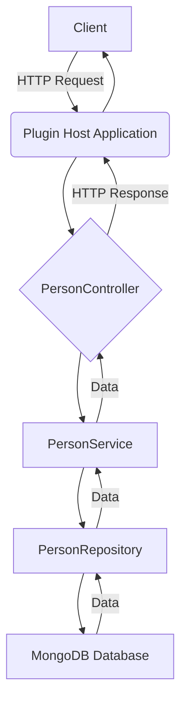

# CRUD Framework with Plugin Architecture

This project demonstrates a modular Spring Boot application designed with a generic CRUD framework and a specific implementation for managing `Person` entities. It showcases a plugin-based architecture where different data stores can be used for different entity types.

## Project Structure

The project is organized into several Maven modules:

*   **`crud-framework` (Parent POM)**: The parent project that defines common dependencies, properties, and manages the sub-modules.
*   **`crud-abstraction`**: This module defines generic interfaces for CRUD operations (Controller, Service, Repository) and a `BaseEntity`. It provides a database-agnostic abstraction layer for CRUD functionalities.
    *   [`CrudController.java`](crud-framework/crud-abstraction/src/main/java/com/jejakin/crud/abstraction/controller/CrudController.java): Generic REST controller interface.
    *   [`CrudService.java`](crud-framework/crud-abstraction/src/main/java/com/jejakin/crud/abstraction/service/CrudService.java): Generic service interface for business logic.
    *   [`CrudRepository.java`](crud-framework/crud-abstraction/src/main/java/com/jejakin/crud/abstraction/repository/CrudRepository.java): Generic repository interface extending Spring Data JPA's `JpaRepository`.
    *   [`BaseEntity.java`](crud-framework/crud-abstraction/src/main/java/com/jejakin/crud/abstraction/model/BaseEntity.java): Abstract base class for entities with an auto-generated `Long id`.
*   **`rest-abstraction`**: This module provides standard REST request/response structures and common HTTP response handling mechanisms.
*   **`people-crud-plugin`**: A concrete implementation of the CRUD abstraction specifically for a `Person` entity. This plugin uses Spring Data MongoDB for persistence, demonstrating the flexibility of the framework to integrate different data stores.
    *   [`Person.java`](crud-framework/people-crud-plugin/src/main/java/com/jejakin/crud/people/model/Person.java): The entity class representing a person, extending `BaseEntity` and annotated as a MongoDB document.
    *   [`PersonController.java`](crud-framework/people-crud-plugin/src/main/java/com/jejakin/crud/people/controller/PersonController.java): REST controller for `Person` entities.
    *   [`PersonService.java`](crud-framework/people-crud-plugin/src/main/java/com/jejakin/crud/people/service/PersonService.java): Service layer for `Person` business logic.
    *   [`PersonRepository.java`](crud-framework/people-crud-plugin/src/main/java/com/jejakin/crud/people/repository/PersonRepository.java): Repository for `Person` entities, extending `MongoRepository`.
*   **`plugin-host-app`**: The main Spring Boot application that integrates the `rest-abstraction` and `people-crud-plugin` modules. It acts as the host for the CRUD plugins and exposes the REST API for `Person` entities. It also includes SpringDoc OpenAPI for API documentation (Swagger UI).

## Key Technologies

*   **Spring Boot**: 3.2.0
*   **Spring Data JPA**: Used in `crud-abstraction` for generic repository definition.
*   **Spring Data MongoDB**: Used in `people-crud-plugin` for `Person` entity persistence.
*   **Lombok**: Reduces boilerplate code.
*   **Maven**: Build automation tool.
*   **SpringDoc OpenAPI (Swagger UI)**: For automatic API documentation.

## Application Flow Diagram



**Explanation:**

1.  A client sends an HTTP request (e.g., `POST /api/people` to create a new person) to the `plugin-host-app`.
2.  The `plugin-host-app` routes the request to the `PersonController` within the `people-crud-plugin`.
3.  The `PersonController` delegates the business logic to the `PersonService`.
4.  The `PersonService` interacts with the `PersonRepository` to perform the necessary database operations.
5.  The `PersonRepository` communicates with the MongoDB database to store or retrieve `Person` data.
6.  The data flows back from the database, through the `PersonRepository`, `PersonService`, and `PersonController`.
7.  Finally, the `PersonController` constructs an HTTP response (potentially using `BaseResponse` from `rest-abstraction`) and sends it back to the client via the `plugin-host-app`.

## Class Diagram

```mermaid
classDiagram
    direction LR
    class BaseEntity {
        +Long id
        +getId()
        +setId()
    }

    interface CrudRepository<T, ID> {
        +T save(T entity)
        +Optional<T> findById(ID id)
        +List<T> findAll()
        +void deleteById(ID id)
    }

    interface CrudService<T, ID> {
        +T save(T entity)
        +Optional<T> findById(ID id)
        +List<T> findAll()
        +void deleteById(ID id)
        +T update(ID id, T entity)
    }

    interface CrudController<T, ID> {
        +ResponseEntity<BaseResponse<T>> create(T entity)
        +ResponseEntity<BaseResponse<T>> getById(ID id)
        +ResponseEntity<BaseResponse<List<T>>> getAll()
        +ResponseEntity<BaseResponse<T>> update(ID id, T entity)
        +ResponseEntity<BaseResponse<Void>> delete(ID id)
    }

    class Person {
        +String nik
        +String firstName
        +String lastName
        +String phoneNumber
        +String address1
        +String address2
    }

    class PersonRepository {
        // Extends MongoRepository<Person, Long>
    }

    class PersonService {
        -PersonRepository repository
        +Person save(Person person)
        +Optional<Person> findById(Long id)
        +List<Person> findAll()
        +void deleteById(Long id)
        +Person update(Long id, Person person)
    }

    class PersonController {
        -PersonService personService
        +ResponseEntity<Person> createPerson(Person person)
        +ResponseEntity<Person> getPersonById(Long id)
        +ResponseEntity<List<Person>> getAllPeople()
        +ResponseEntity<Person> updatePerson(Long id, Person person)
        +ResponseEntity<Void> deletePerson(Long id)
    }

    BaseEntity <|-- Person : extends
    CrudRepository <|-- PersonRepository : implements
    CrudService <|-- PersonService : implements
    CrudController <|-- PersonController : implements

    PersonService --> PersonRepository : uses
    PersonController --> PersonService : uses