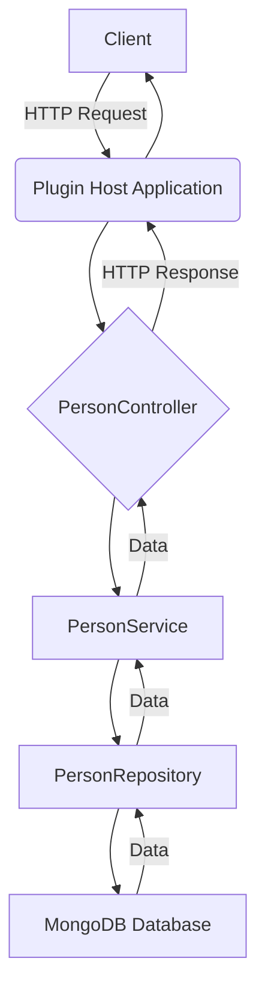
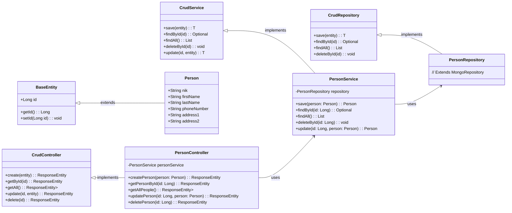

# CRUD Framework with Plugin Architecture

Proyek ini mendemonstrasikan aplikasi Spring Boot modular yang dirancang dengan kerangka kerja CRUD generik dan implementasi spesifik untuk mengelola entitas `Person`. Ini menampilkan arsitektur berbasis plugin di mana penyimpanan data yang berbeda dapat digunakan untuk jenis entitas yang berbeda.

## Arsitektur Microkernel/Plugin

Proyek ini terstruktur di sekitar arsitektur microkernel (atau plugin), yang mendorong ekstensibilitas dan fleksibilitas. Ide intinya adalah menjaga sistem pusat (microkernel) tetap kecil dan fokus pada fungsionalitas esensial, sambil memungkinkan fitur tambahan dan logika bisnis ditambahkan sebagai plugin independen.

Dalam arsitektur ini:

*   **Microkernel (Sistem Inti)**: Diwakili oleh modul `crud-abstraction` dan `rest-abstraction`, bersama dengan `plugin-host-app`.
    *   **`crud-abstraction`**: Menyediakan kontrak inti (interface) untuk operasi CRUD, mendefinisikan bagaimana plugin harus berinteraksi dengan sistem untuk manajemen data. Ini adalah fondasi abstrak.
    *   **`rest-abstraction`**: Menawarkan cara standar bagi plugin untuk mengekspos RESTful APIs dan menangani respons, memastikan konsistensi di semua plugin yang terintegrasi.
    *   **`plugin-host-app`**: Bertindak sebagai aplikasi utama yang memuat dan mengatur plugin-plugin ini. Ini menyediakan lingkungan runtime dan mengintegrasikan fungsionalitas yang diekspos oleh berbagai plugin.
*   **Plugins**: Modul independen yang memperluas fungsionalitas microkernel.
    *   **`people-crud-plugin`**: Modul ini berfungsi sebagai contoh konkret dari sebuah plugin. Ini mengimplementasikan interface `crud-abstraction` untuk entitas spesifik (`Person`) dan berintegrasi dengan penyimpanan data tertentu (MongoDB). Ini menunjukkan bagaimana jenis entitas baru dan penanganan datanya masing-masing dapat "dipasang" tanpa memodifikasi sistem inti.

Desain ini memungkinkan:
*   **Modularitas**: Fitur-fitur diisolasi ke dalam plugin yang berbeda, membuat sistem lebih mudah dipahami, dikembangkan, dan dipelihara.
*   **Ekstensibilitas**: Fungsionalitas baru (misalnya, CRUD untuk entitas lain seperti `Product`, `Order`) dapat ditambahkan hanya dengan membuat plugin baru yang mematuhi abstraksi yang ditentukan, tanpa mengubah inti yang ada atau plugin lainnya.
*   **Fleksibilitas**: Plugin yang berbeda dapat menggunakan teknologi atau penyimpanan data yang berbeda (misalnya, satu plugin menggunakan MongoDB, yang lain dapat menggunakan PostgreSQL) sambil tetap sesuai dengan interface CRUD umum.
*   **Skalabilitas**: Plugin individual berpotensi dapat diskalakan secara independen jika diterapkan sebagai layanan terpisah, meskipun dalam contoh ini, mereka diintegrasikan dalam satu aplikasi host.

## Project Structure

The project is organized into several Maven modules:

*   **`crud-framework` (Parent POM)**: The parent project that defines common dependencies, properties, and manages the sub-modules.
*   **`crud-abstraction`**: This module defines generic interfaces for CRUD operations (Controller, Service, Repository) and a `BaseEntity`. It provides a database-agnostic abstraction layer for CRUD functionalities.
    *   [`CrudController.java`](crud-framework/crud-abstraction/src/main/java/com/jejakin/crud/abstraction/controller/CrudController.java): Generic REST controller interface.
    *   [`CrudService.java`](crud-framework/crud-abstraction/src/main/java/com/jejakin/crud/abstraction/service/CrudService.java): Generic service interface for business logic.
    *   [`CrudRepository.java`](crud-framework/crud-abstraction/src/main/java/com/jejakin/crud/abstraction/repository/CrudRepository.java): Generic repository interface extending Spring Data JPA's `JpaRepository`.
    *   [`BaseEntity.java`](crud-framework/crud-abstraction/src/main/java/com/jejakin/crud/abstraction/model/BaseEntity.java): Abstract base class for entities with an auto-generated `Long id`.
*   **`rest-abstraction`**: This module provides standard REST request/response structures and common HTTP response handling mechanisms.
*   **`people-crud-plugin`**: A concrete implementation of the CRUD abstraction specifically for a `Person` entity. This plugin uses Spring Data MongoDB for persistence, demonstrating the flexibility of the framework to integrate different data stores.
    *   [`Person.java`](crud-framework/people-crud-plugin/src/main/java/com/jejakin/crud/people/model/Person.java): The entity class representing a person, extending `BaseEntity` and annotated as a MongoDB document.
    *   [`PersonController.java`](crud-framework/people-crud-plugin/src/main/java/com/jejakin/crud/people/controller/PersonController.java): REST controller for `Person` entities.
    *   [`PersonService.java`](crud-framework/people-crud-plugin/src/main/java/com/jejakin/crud/people/service/PersonService.java): Service layer for `Person` business logic.
    *   [`PersonRepository.java`](crud-framework/people-crud-plugin/src/main/java/com/jejakin/crud/people/repository/PersonRepository.java): Repository for `Person` entities, extending `MongoRepository`.
*   **`plugin-host-app`**: The main Spring Boot application that integrates the `rest-abstraction` and `people-crud-plugin` modules. It acts as the host for the CRUD plugins and exposes the REST API for `Person` entities. It also includes SpringDoc OpenAPI for API documentation (Swagger UI).

## Key Technologies

*   **Spring Boot**: 3.2.0
*   **Spring Data JPA**: Used in `crud-abstraction` for generic repository definition.
*   **Spring Data MongoDB**: Used in `people-crud-plugin` for `Person` entity persistence.
*   **Lombok**: Reduces boilerplate code.
*   **Maven**: Build automation tool.
*   **SpringDoc OpenAPI (Swagger UI)**: For automatic API documentation.

## Application Flow Diagram

**Penjelasan:**

1.  Klien mengirimkan permintaan HTTP (misalnya, `POST /api/people` untuk membuat orang baru) ke `plugin-host-app`.
2.  `plugin-host-app` mengarahkan permintaan ke `PersonController` di dalam `people-crud-plugin`.
3.  `PersonController` mendelegasikan logika bisnis ke `PersonService`.
4.  `PersonService` berinteraksi dengan `PersonRepository` untuk melakukan operasi database yang diperlukan.
5.  `PersonRepository` berkomunikasi dengan database MongoDB untuk menyimpan atau mengambil data `Person`.
6.  Data mengalir kembali dari database, melalui `PersonRepository`, `PersonService`, dan `PersonController`.
7.  Akhirnya, `PersonController` membuat respons HTTP (berpotensi menggunakan `BaseResponse` dari `rest-abstraction`) dan mengirimkannya kembali ke klien melalui `plugin-host-app`.

## Class Diagram

