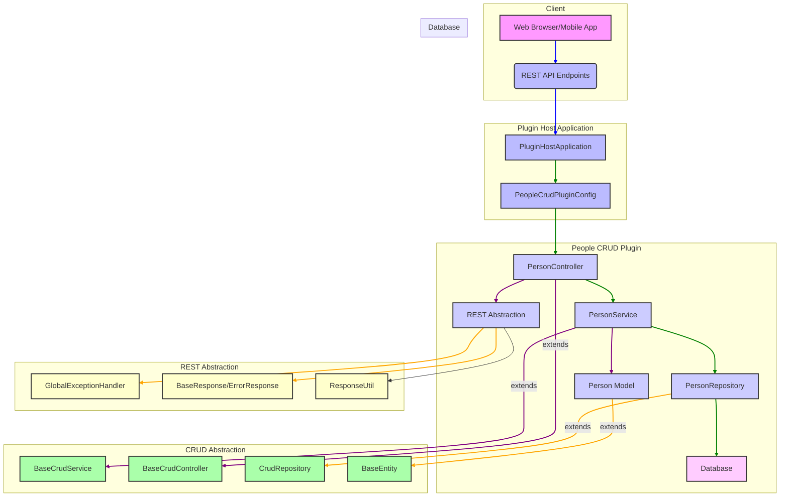
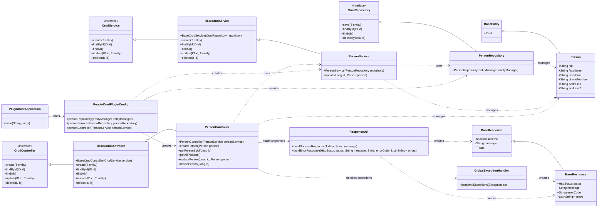

# Diagram Arsitektur



# Penjelasan Arsitektur

Aplikasi ini mengikuti arsitektur berbasis plugin, di mana `Plugin Host Application` bertindak sebagai wadah untuk `People CRUD Plugin` dan plugin lainnya yang mungkin ditambahkan di masa mendatang.

**Komponen Utama:**

1.  **Client:** Mewakili antarmuka pengguna (misalnya, browser web atau aplikasi seluler) yang berinteraksi dengan aplikasi melalui REST API.
2.  **Plugin Host Application:**
    *   `PluginHostApplication`: Aplikasi Spring Boot utama yang memulai konteks aplikasi dan menghosting plugin.
    *   `PeopleCrudPluginConfig`: Kelas konfigurasi untuk plugin CRUD People, yang kemungkinan mendaftarkan bean atau komponen spesifik plugin.
3.  **People CRUD Plugin:** Ini adalah plugin inti yang menyediakan fungsionalitas CRUD untuk entitas `Person`.
    *   `PersonController`: Menangani permintaan HTTP yang terkait dengan entitas `Person` (misalnya, membuat, membaca, memperbarui, menghapus). Ini mendelegasikan logika bisnis ke `PersonService`.
    *   `PersonService`: Berisi logika bisnis untuk operasi `Person`. Ini berinteraksi dengan `PersonRepository` untuk persistensi data.
    *   `PersonRepository`: Antarmuka repositori yang bertanggung jawab untuk berinteraksi dengan database untuk operasi CRUD `Person`.
    *   `Person Model`: Kelas entitas yang merepresentasikan data `Person`.
4.  **CRUD Abstraction:** Modul ini menyediakan kerangka kerja abstrak untuk operasi CRUD, mempromosikan penggunaan kembali kode dan konsistensi di seluruh plugin.
    *   `BaseCrudController`: Kelas dasar abstrak untuk pengontrol CRUD, menyediakan implementasi umum untuk operasi REST.
    *   `CrudController`: Antarmuka yang mendefinisikan operasi pengontrol CRUD.
    *   `BaseCrudService`: Kelas dasar abstrak untuk layanan CRUD, menyediakan implementasi umum untuk logika bisnis.
    *   `CrudService`: Antarmuka yang mendefinisikan operasi layanan CRUD.
    *   `CrudRepository`: Antarmuka dasar untuk repositori, kemungkinan memperluas antarmuka Spring Data JPA.
    *   `BaseEntity`: Kelas dasar abstrak untuk entitas model, menyediakan bidang umum seperti ID.
5.  **REST Abstraction:** Modul ini menyediakan utilitas dan penanganan kesalahan standar untuk REST API.
    *   `GlobalExceptionHandler`: Menangani pengecualian secara global di seluruh aplikasi dan mengembalikan respons kesalahan yang diformat.
    *   `BaseResponse`: Kelas respons generik untuk mengembalikan data yang berhasil.
    *   `ErrorResponse`: Kelas respons khusus untuk mengembalikan detail kesalahan.
    *   `ResponseUtil`: Kelas utilitas untuk membuat objek respons standar.
6.  **Database:** Lapisan persistensi tempat data `Person` disimpan.

# Diagram Alur (Contoh: Membuat Person Baru)

```mermaid
graph TD
    A[Client] -->|POST /persons| B[PersonController]
    B -->|Call create(person)| C[PersonService]
    C -->|Call save(person)| D[PersonRepository]
    D -->|Persist data| E[Database]
    E -->|Return saved Person| D
    D -->|Return saved Person| C
    C -->|Return saved Person| B
    B -->|Return BaseResponse(success, message, Person)| A

    style A fill:#f9f,stroke:#333,stroke-width:2px
    style B fill:#ccf,stroke:#333,stroke-width:2px
    style C fill:#ccf,stroke:#333,stroke-width:2px
    style D fill:#ccf,stroke:#333,stroke-width:2px
    style E fill:#fcf,stroke:#333,stroke-width:2px

    linkStyle 0 stroke-width:2px,fill:none,stroke:blue;
    linkStyle 1 stroke-width:2px,fill:none,stroke:green;
    linkStyle 2 stroke-width:2px,fill:none,stroke:green;
    linkStyle 3 stroke-width:2px,fill:none,stroke:red;
    linkStyle 4 stroke-width:2px,fill:none,stroke:green;
    linkStyle 5 stroke-width:2px,fill:none,stroke:green;
    linkStyle 6 stroke-width:2px,fill:none,stroke:green;
    linkStyle 7 stroke-width:2px,fill:none,stroke:blue;
```

# Penjelasan Alur (Contoh: Membuat Person Baru)

1.  **Client Mengirim Permintaan:** Klien (misalnya, aplikasi web) mengirimkan permintaan HTTP POST ke endpoint `/persons` dengan data `Person` baru di badan permintaan.
2.  **PersonController Menerima Permintaan:** `PersonController` menerima permintaan, memvalidasi data, dan memanggil metode `create` di `PersonService`.
3.  **PersonService Memproses Logika Bisnis:** `PersonService` menerapkan logika bisnis apa pun (misalnya, validasi tambahan, transformasi data) dan kemudian memanggil metode `save` di `PersonRepository`.
4.  **PersonRepository Berinteraksi dengan Database:** `PersonRepository` bertanggung jawab untuk berinteraksi dengan database (misalnya, menggunakan Spring Data JPA) untuk menyimpan objek `Person` baru.
5.  **Database Menyimpan Data:** Database menyimpan data `Person` dan mengembalikan objek `Person` yang disimpan (dengan ID yang dihasilkan) ke `PersonRepository`.
6.  **PersonRepository Mengembalikan Hasil:** `PersonRepository` mengembalikan objek `Person` yang disimpan ke `PersonService`.
7.  **PersonService Mengembalikan Hasil:** `PersonService` mengembalikan objek `Person` yang disimpan ke `PersonController`.
8.  **PersonController Mengembalikan Respons:** `PersonController` membuat `BaseResponse` yang menunjukkan keberhasilan operasi, menyertakan objek `Person` yang baru dibuat, dan mengirimkannya kembali ke klien.

# Diagram Kelas UML



Ini adalah gambaran umum arsitektur dan alur. Apakah Anda ingin saya menambahkan detail lebih lanjut atau memodifikasi diagram ini?